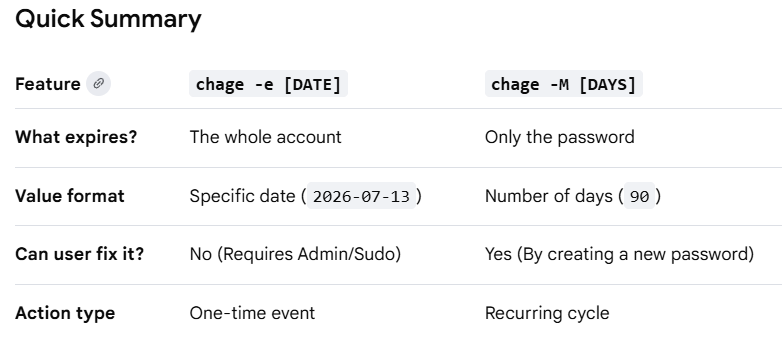

# Day 2: Temporary User Setup with Expiry

## Task
Need to create a user which has a expiry date 

## Though Process why is this Needed

1. Create User
    - In linux, a user account is person or service that interact with system
    - It consists of 
        - user-name
        - home directory
        - permissions
        - password(optional)
    - uses `useradd` command to create user

2. Expiry Date
    - means the account will be automatically disabled after a specific day.
    - Use full for temporary usecase, contract developers,etc
    - uses `-e` flag in `useradd` to set expiry date

## Steps

1. SSH to the app server specified

    ```sh
    ssh username@server-name
    ```

2. Add user with expiry date using this command

    ```sh
    sudo useradd -e YYYY-MM-DD <user-name>
    ```

3. Verify Output
    ```sh
    sudo chage -l <user-name>
    ```
    > output: Account expires: Jan 18, 2026

    chage -l --> list the password aging and expiry information for a user.

## Key Learnings

- Can create temporary user by set its expiry date.
- After the expiry date the user is unable to login, the files stays unless deleted.
- This feature helps me to set time limit on user accounts and can control who can log in and for how long being the basic part of linux security best practices

## Content Beyond Task


