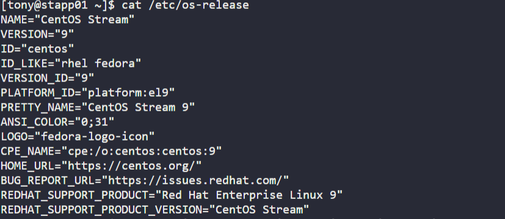
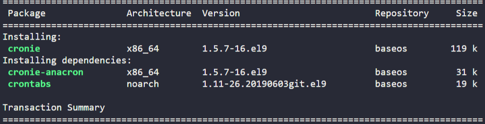
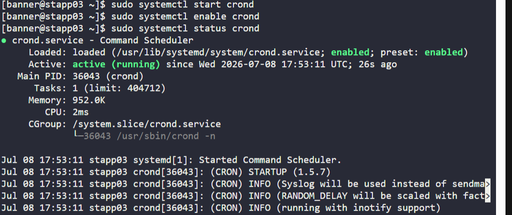
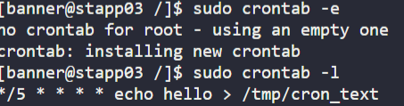

# Day 6: Create a Cron Job

## Introduction

### What is a Cron Job?

A **cron job** is a time-based task scheduler available on Unix-like operating systems. It allows you to automate repetitive tasks by running commands or scripts at scheduled intervals, dates, or times without manual intervention.

Cron jobs are managed by the **cron daemon (`crond`)**, which continuously runs in the background.

### How Cron Works

1. **Cron Daemon (`crond`)**
   - A background service that constantly runs on the system.

2. **Crontab**
   - Every minute, `crond` checks the scheduled tasks stored in a configuration file called the **crontab**.

3. **Execution**
   - If the current time matches a scheduled task, `crond` automatically executes the associated command or script.

---

## Real-World Use Cases

- **Database Backups**
  - Automatically create backups every night at 2:00 AM.

- **System Maintenance**
  - Clean temporary files and old logs every weekend.

- **Software Updates**
  - Check for and install security updates automatically.

- **Monitoring**
  - Run health checks and send alerts if a service stops responding.

- **Reports**
  - Generate and email daily or weekly reports automatically.

---

## Benefits of Cron Jobs

- **Automation**
  - Eliminates repetitive manual work.

- **Reliability**
  - Executes tasks exactly on schedule.

- **Efficiency**
  - Reduces human error.

- **Resource Optimization**
  - Allows heavy tasks to run during low-traffic hours.

---

# Task

On all Nautilus App Servers:

- Install the **cronie** package.
- Start the **crond** service.
- Create a cron job for the **root** user that runs every **5 minutes**:

```sh
echo hello > /tmp/cron_text
```

---

# Steps

## Step 1: SSH into the Linux Server

```sh
ssh username@servername
```

---

## Step 2: Identify the Linux Distribution

Before installing packages, determine which Linux distribution the server is running.

```sh
cat /etc/os-release
```



Different Linux distributions use different package managers.

| Distribution | Package Manager |
|--------------|-----------------|
| CentOS / RHEL | `dnf` or `yum` |
| Ubuntu / Debian | `apt` |

Since the server is running **CentOS Stream**, use **yum** (or **dnf**) to install the required package.

---

## Step 3: Install the Cronie Package

```sh
sudo yum install -y cronie
```

### Command Explanation

- `sudo` → Runs the command with administrator privileges.
- `yum` → Package manager for CentOS/RHEL.
- `install` → Installs the specified package.
- `-y` → Automatically answers **Yes** to all prompts.

### Package Installed

| Package | Purpose |
|---------|---------|
| `cronie` | Provides the cron daemon (`crond`) and cron scheduling utilities. |



---

## Step 4: Verify the Installation

```sh
rpm -q cronie
```

### Command Explanation

- `rpm` → RPM package management tool.
- `-q` (`query`) → Checks whether the package is installed.

If installed, the command displays the package version, for example:

```text
cronie-1.x.x
```

---

## Step 5: Start and Enable the Cron Service

Start the cron daemon:

```sh
sudo systemctl start crond
```

Enable the service so it starts automatically after reboot:

```sh
sudo systemctl enable crond
```

Verify that the service is running:

```sh
sudo systemctl status crond
```

If everything is configured correctly, the output should contain:

```text
Active: active (running)
```



---

## Step 6: Create a Cron Job

Open the root user's crontab:

```sh
sudo crontab -e
```

Add the following line:

```sh
*/5 * * * * echo hello > /tmp/cron_text
```

### Cron Expression Breakdown

| Field | Value | Meaning |
|-------|------|---------|
| Minute | `*/5` | Every 5 minutes |
| Hour | `*` | Every hour |
| Day of Month | `*` | Every day |
| Month | `*` | Every month |
| Day of Week | `*` | Every day of the week |

### Command Explanation

```sh
echo hello > /tmp/cron_text
```

- `echo hello` → Prints the word **hello**.
- `>` → Redirects the output to a file.
- `/tmp/cron_text` → Destination file.

Every five minutes, the cron job overwrites the contents of `/tmp/cron_text` with:

```text
hello
```

---

## Step 7: Save and Verify the Cron Job

Save and exit the crontab editor.

Verify that the cron job has been added successfully:

```sh
sudo crontab -l
```

The output should display:

```sh
*/5 * * * * echo hello > /tmp/cron_text
```



---

## Step 8: Verify the Cron Job Execution

Wait for a little over **5 minutes**.

Then check whether the cron job has created the file:

```sh
cat /tmp/cron_text
```

Expected output:

```text
hello
```

If the output is displayed, the cron job has executed successfully.


---

# Key Learnings

After completing this exercise, you should understand:

- What a cron job is and how it automates repetitive tasks.
- The role of the **crond** daemon in executing scheduled jobs.
- How to identify the Linux distribution before installing packages.
- How to install the **cronie** package on CentOS/RHEL systems.
- How to start, enable, and verify the **crond** service.
- How to create and edit cron jobs using `crontab`.
- How to read and interpret a cron schedule expression.
- How to verify scheduled jobs using `crontab -l`.
- How to confirm that a cron job executed successfully by checking its output.