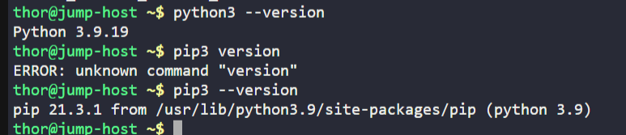
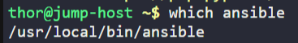

# Day 8: Install Ansible

## Introduction

### What is Ansible?

**Ansible** is an open-source **automation**, **configuration management**, and **orchestration** tool developed by Red Hat. It enables system administrators and DevOps engineers to automate repetitive tasks such as software installation, server configuration, application deployment, and infrastructure provisioning.

Unlike many automation tools, Ansible is **agentless**, meaning it does not require any software to be installed on the managed servers. It communicates with remote machines securely using **SSH**.

---

## Why is Ansible Needed?

Managing a few servers manually may be simple, but administering dozens or hundreds of servers quickly becomes time-consuming and error-prone.

Ansible helps by automating common administrative tasks, ensuring consistency across systems and reducing manual effort.

Some common use cases include:

- Installing software on multiple servers.
- Managing configuration files.
- Deploying applications.
- Creating and managing users.
- Performing operating system updates.
- Restarting services.
- Automating infrastructure provisioning.
- Executing commands across multiple servers simultaneously.

By using Ansible, organizations can achieve:

- Faster deployments
- Consistent server configurations
- Reduced human error
- Improved scalability
- Easier infrastructure management

---

## Why Use a Jump Host as an Ansible Controller?

A **Jump Host (Bastion Host)** is a secure server used to access other servers within a private network.

Instead of installing Ansible on every server, it is installed only on the **Jump Host**, which acts as the **Ansible Controller**.

From the controller, Ansible connects to all managed nodes over SSH and executes tasks remotely.

```
                Jump Host
          (Ansible Controller)
                  │
         ┌────────┼────────┐
         │        │        │
         ▼        ▼        ▼
     App Server1 App Server2 App Server3
      (Managed)   (Managed)   (Managed)
```

---

## Task

On the **Jump Host**:

- Install **Ansible version `4.10.0`** using **`pip3` only**.
- Ensure the **Ansible binary is available globally**, allowing **all users** on the system to execute Ansible commands.

---

# Steps

## Step 1: Verify Python and pip3

Before installing Ansible, verify that Python and pip3 are available.

Check the Python version:

```sh
python3 --version
```

Check the pip version:

```sh
pip3 --version
```

If both commands return version information, the system is ready for installation.

---

## Step 2: Install Ansible Using pip3

Install the required version of Ansible:

```sh
sudo pip3 install ansible==4.10.0
```

### Command Explanation

- `sudo` → Runs the command with administrator privileges.
- `pip3` → Python package manager for Python 3.
- `install` → Installs the specified package.
- `ansible==4.10.0` → Installs exactly version **4.10.0**.

---

## Step 3: Verify the Installation

Confirm that Ansible has been installed successfully:

```sh
ansible --version
```

Expected output should include:

```text
ansible [core 2.11.x]
```

and

```text
ansible 4.10.0
```

This verifies that the required version has been installed successfully.

---

## Step 4: Verify the Binary is Available Globally

Ensure that every user can execute the Ansible command.

Check the binary location:

```sh
which ansible
```


Example output:

```text
/usr/local/bin/ansible
```

Verify that another user can access it:

```sh
su - <username>
ansible --version
```

If the command executes successfully, Ansible is available system-wide.

---

## Step 5: Verify Using pip3

Check the installed package details:

```sh
pip3 show ansible
```

Example output:

```text
Name: ansible
Version: 4.10.0
```

This confirms that the required package version is installed.

---

# Common Ansible Commands

Check the Ansible version:

```sh
ansible --version
```

List inventory hosts:

```sh
ansible all --list-hosts
```

Ping all managed servers:

```sh
ansible all -m ping
```

Run a command on all managed servers:

```sh
ansible all -a "hostname"
```

---

# Why SSH is Important in Ansible

Ansible communicates with remote servers using **SSH**.

Before using Ansible, ensure:

- Password-less SSH authentication is configured.
- The controller can SSH into all managed nodes.
- Python is installed on the managed servers.

Since Ansible is **agentless**, no additional software needs to be installed on the managed machines.

---

# Things to Remember

- Ansible is **agentless** and uses SSH for communication.
- Only the controller machine requires Ansible installation.
- Managed nodes do not require the Ansible package.
- Installing via `pip3` allows specific versions to be installed easily.
- Verify the installation using `ansible --version`.
- Ensure the Ansible binary is available in the system's global `PATH` so all users can execute it.

---

# Key Learnings

After completing this exercise, you should understand:

- What Ansible is and its role in automation and configuration management.
- The advantages of Ansible's agentless architecture.
- Why organizations use Ansible for infrastructure automation.
- The purpose of a Jump Host acting as an Ansible Controller.
- How Ansible communicates securely using SSH.
- How to install a specific Ansible version using `pip3`.
- How to verify the installed Ansible version.
- How to ensure the Ansible binary is globally accessible.
- Basic Ansible commands used to interact with managed servers.
- Why password-less SSH authentication is important before using Ansible for automation.

---

# Additional Learnings

- **Controller Node**: The machine where Ansible is installed and from which automation tasks are executed.

- **Managed Nodes**: Remote servers that Ansible controls over SSH.

- **Inventory**: A file containing the list of managed hosts and groups.

- **Module**: A reusable unit of work in Ansible (e.g., `ping`, `copy`, `yum`, `service`).

- **Playbook**: A YAML file that defines one or more automation tasks to be executed on managed hosts.

- **Idempotency**: One of Ansible's key features. Running the same playbook multiple times produces the same result without making unnecessary changes.

- **Agentless Architecture**: Unlike tools such as Puppet or Chef, Ansible does not require agents to be installed on managed servers, making deployment and maintenance much simpler.