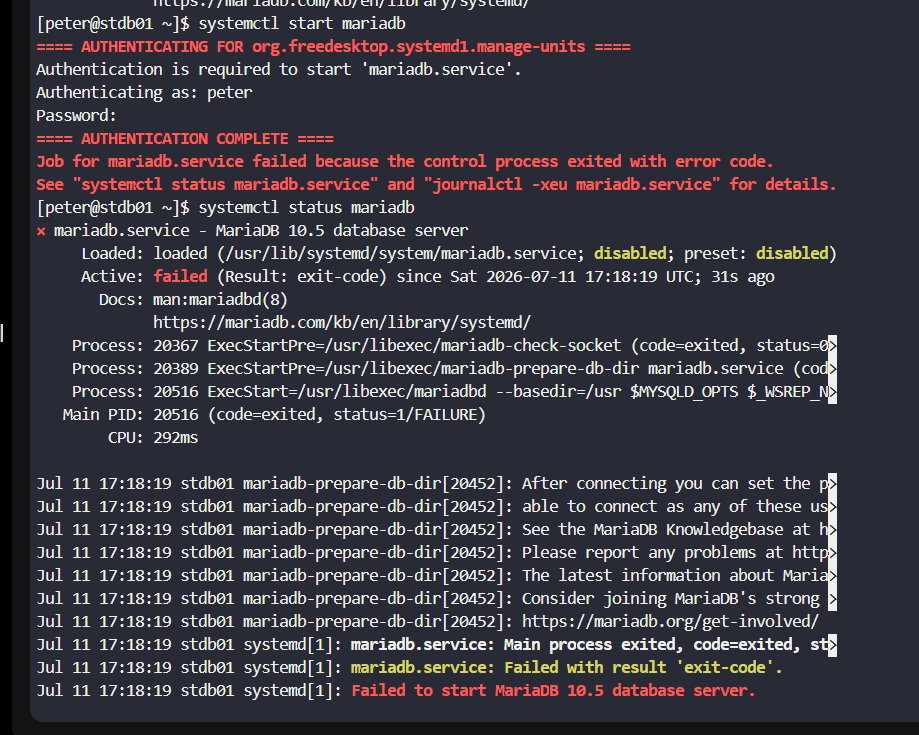
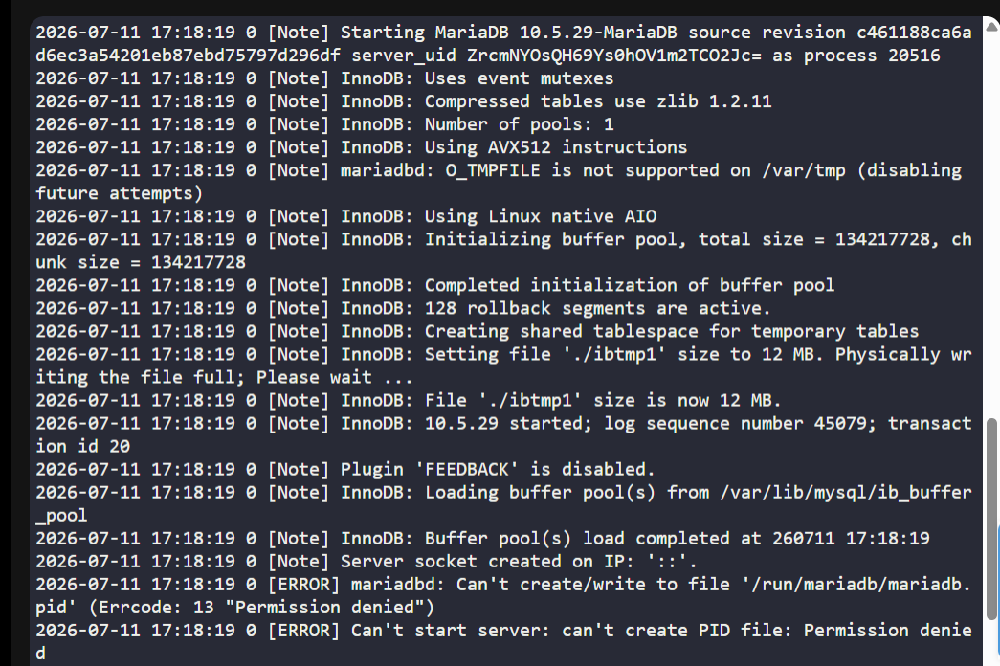
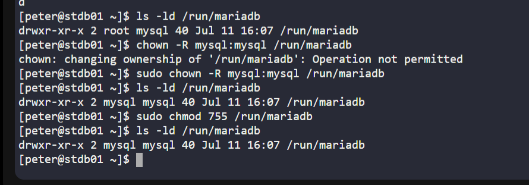
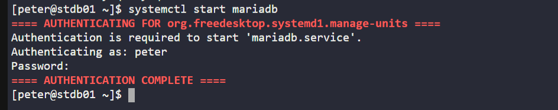
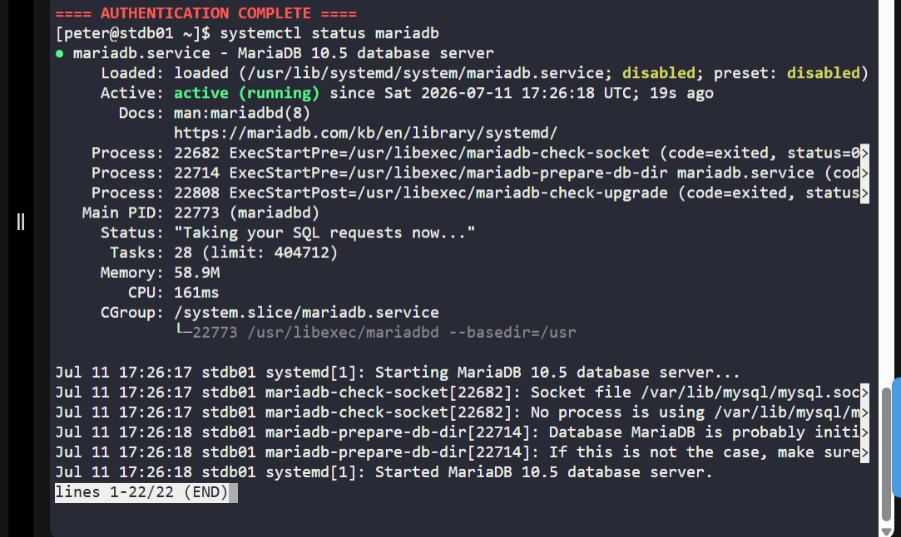

# Day 9: MariaDB Troubleshooting

## Introduction

### What is MariaDB?

**MariaDB** is an open-source Relational Database Management System (RDBMS) that is widely used as a drop-in replacement for MySQL. It stores and manages application data and is commonly used by web applications and enterprise systems.

If the MariaDB service stops or fails to start, applications that depend on it may become unavailable.

---

## Why is MariaDB Troubleshooting Needed?

In production environments, database availability is critical. Even a small issue, such as incorrect permissions or a missing directory, can prevent the database from starting and cause application downtime.

A DevOps engineer should be able to:

- Identify why a service has failed.
- Analyze logs to determine the root cause.
- Fix the underlying issue instead of applying temporary workarounds.
- Restore the service quickly to minimize downtime.

---

# Task

The Nautilus application in the Stratos Datacenter was unavailable because the **MariaDB** service on the database server was not running.

Troubleshoot the issue, identify the root cause, fix it, and restore the MariaDB service.

---

# Steps

## Step 1: SSH into the Database Server

Connect to the database server and switch to the root user.

```sh
ssh user@db-server
sudo su -
```

---

## Step 2: Attempt to Start the MariaDB Service

Try starting the MariaDB service.

```sh
systemctl start mariadb
```

The service failed to start.

---

## Step 3: Check the Service Status

Inspect the service status to get more information.

```sh
systemctl status mariadb
```

The output indicated:

```text
Exit status: 1 (FAILURE)
```

This confirmed that MariaDB failed to start and further investigation was required.


---

## Step 4: Verify the Data Directory

Check whether the MariaDB data directory exists and has the correct ownership.

```sh
ls -ld /var/lib/mysql
```

Example output:

```text
drwxr-xr-x mysql mysql ...
```

The permissions and ownership were correct, indicating that the problem was not with the data directory.

---

## Step 5: Examine the MariaDB Error Log

Review the last few lines of the MariaDB log.

```sh
cat /var/log/mariadb/mariadb.log | tail -30
```

The log revealed the actual issue:

```text
[ERROR] mariadbd: Can't create/write to file '/run/mariadb/mariadb.pid'
Permission denied

[ERROR] Can't start server:
can't create PID file: Permission denied
```

This indicated that MariaDB did not have permission to create its PID file inside the `/run/mariadb` directory.


---

## Step 6: Fix the Directory Permissions

Update the ownership of the runtime directory.

```sh
chown -R mysql:mysql /run/mariadb
```

Set the correct permissions.

```sh
chmod 755 /run/mariadb
```

### Command Explanation

- `chown -R mysql:mysql` changes the owner and group of the directory and its contents to the `mysql` user.
- `chmod 755` grants:
  - Read, write, and execute permissions to the owner.
  - Read and execute permissions to the group and others.

This allows MariaDB to create the required PID file.

> **Note:** If the `/run/mariadb` directory does not exist, create it first:

```sh
mkdir -p /run/mariadb
```

Then apply the ownership and permissions.


---

## Step 7: Restart MariaDB

Restart the service.

```sh
systemctl start mariadb
```

---

## Step 8: Verify the Service

Check the service status.

```sh
systemctl status mariadb
```

Expected output:

```text
Active: active (running)
```

This confirms that MariaDB is running successfully and the issue has been resolved.


---

# Troubleshooting Workflow

```text
MariaDB Service Failed
          │
          ▼
Check Service Status
(systemctl status mariadb)
          │
          ▼
Inspect Error Logs
(/var/log/mariadb/mariadb.log)
          │
          ▼
Identify Root Cause
(Permission denied on /run/mariadb)
          │
          ▼
Fix Ownership & Permissions
(chown + chmod)
          │
          ▼
Restart MariaDB
          │
          ▼
Verify Service Status
(active (running))
```

---

# Key Learnings

- Always check the service status before making changes.
- System logs are the best source for identifying the root cause of service failures.
- Incorrect ownership or permissions on runtime directories can prevent MariaDB from starting.
- Follow a structured troubleshooting approach: **Verify → Analyze Logs → Identify Root Cause → Fix → Validate**.