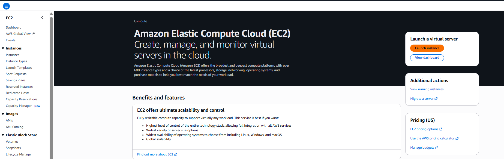
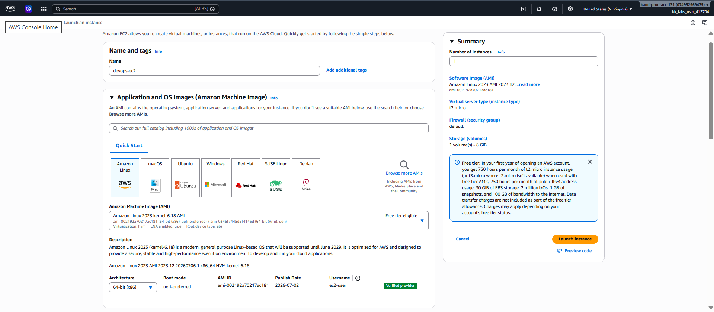
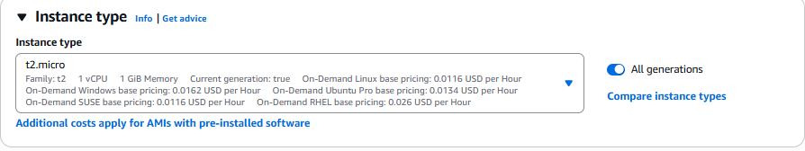
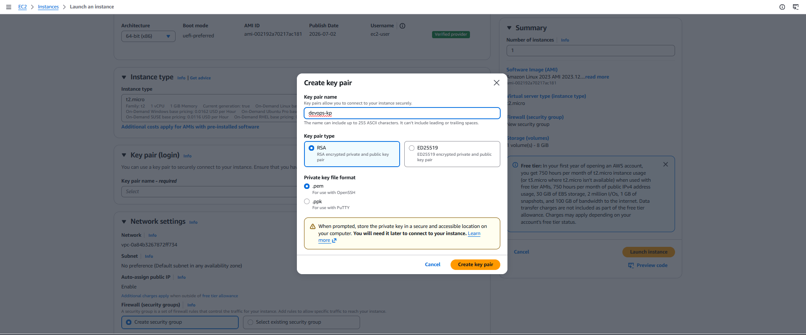

# Day 6: Launch an EC2 Instance

## Introduction

### What is Amazon EC2?

**Amazon Elastic Compute Cloud (EC2)** is an AWS service that provides secure, resizable virtual servers in the cloud. An EC2 instance gives you complete control over the operating system, software, storage, and networking, just like a physical server.

### Important Concepts

#### Amazon Machine Image (AMI)
An **Amazon Machine Image (AMI)** is a pre-configured template used to launch an EC2 instance. It contains:
- Operating System (Amazon Linux in this task)
- Required software packages
- Configuration settings

#### Instance Type
The **Instance Type** determines the hardware resources allocated to the instance, such as:
- CPU (vCPUs)
- Memory (RAM)
- Network performance

For this task, we will use **`t2.micro`**, which is Free Tier eligible and suitable for learning and small workloads.

#### Key Pair
A **Key Pair** is used to securely connect to an EC2 instance using SSH.

It consists of:
- **Public Key** – Stored by AWS
- **Private Key (.pem file)** – Downloaded and stored securely on your local machine

> **Note:** The private key can only be downloaded once during creation. Keep it in a safe location.

#### Security Group
A **Security Group** acts as a virtual firewall for your EC2 instance. It controls inbound and outbound traffic.

For this task, use the **default security group** available in your VPC.

---

# Task

Create an EC2 instance with the following configuration:

| Setting | Value |
|----------|-------|
| Instance Name | `devops-ec2` |
| AMI | Amazon Linux |
| Instance Type | `t2.micro` |
| Key Pair | Create a new RSA key pair named `devops-kp` |
| Security Group | Attach the existing **default** security group |

---

# Steps

## Step 1: Open the EC2 Console

Navigate to the **AWS Management Console**.

Go to:

**Services → EC2 → Instances → Launch Instance**



---

## Step 2: Configure the Instance Name

Enter the instance name:

```
devops-ec2
```

---

## Step 3: Choose the Amazon Machine Image (AMI)

Select:

- **Amazon Linux**

This AMI provides a lightweight and secure Linux operating system optimized for AWS.



---

## Step 4: Select the Instance Type

Choose:

```
t2.micro
```

This instance type is Free Tier eligible and is suitable for basic workloads and learning purposes.

For more information, refer to the AWS documentation:

- https://docs.aws.amazon.com/ec2/latest/instancetypes/instance-types.html



---

## Step 5: Create a New Key Pair

Under **Key Pair (login)**:

Click **Create new key pair** and configure:

| Option | Value |
|---------|-------|
| Key Pair Name | `devops-kp` |
| Key Pair Type | RSA |
| Private Key Format | `.pem` |

Download the `.pem` file and store it securely.

> **Important:** AWS allows the private key to be downloaded only once.



---

## Step 6: Configure Network Settings

Keep the default network settings.

Under **Firewall (Security Groups)**:

- Select **Choose existing security group**
- Attach the existing **default** security group

No additional changes are required for this task.

---

## Network Settings (Overview)

Although no customization is required for this exercise, the network settings determine how your EC2 instance communicates within AWS and with the internet.

Some commonly configured options include:

- **VPC (Virtual Private Cloud)**
  - Defines the isolated virtual network where the instance will be launched.
  - The default VPC is automatically selected.

- **Subnet**
  - Specifies the Availability Zone where the instance will reside.

- **Auto-assign Public IPv4 Address**
  - Assigns a public IP address to the instance so it can be accessed from the internet.

- **IPv6 Address**
  - Optionally assigns an IPv6 address.

- **Security Groups**
  - Act as virtual firewalls that control inbound and outbound traffic to the instance.

For this lab, simply use the **default network configuration**.

---

## Step 7: Launch the Instance

Review all the configuration details and click:

**Launch Instance**

Once the launch is complete, your EC2 instance should appear in the **Instances** page with the following configuration:

| Property | Value |
|----------|-------|
| Name | `devops-ec2` |
| Operating System | Amazon Linux |
| Instance Type | `t2.micro` |
| Key Pair | `devops-kp` |
| Security Group | Default |

---

# Key Learnings

After completing this exercise, you should understand:

- What Amazon EC2 is and why it is used.
- The purpose of an Amazon Machine Image (AMI).
- How instance types determine CPU and memory resources.
- Why SSH key pairs are required for secure access to Linux instances.
- The importance of securely storing the private `.pem` key.
- The role of Security Groups as virtual firewalls.
- The basic steps involved in launching an EC2 instance using the AWS Management Console.
- How the default VPC and default Security Group simplify instance deployment for beginners.