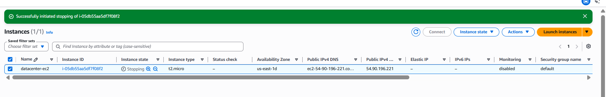
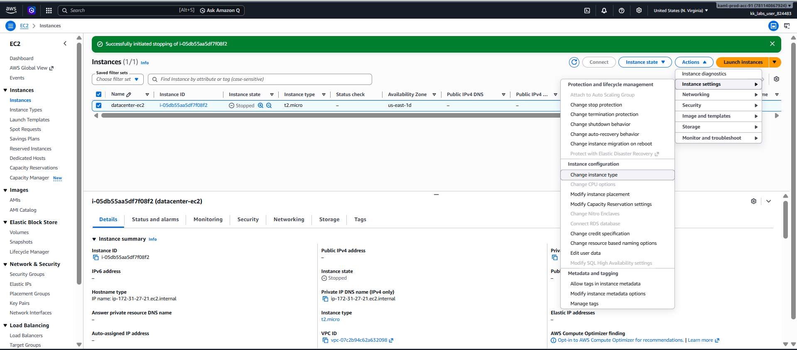
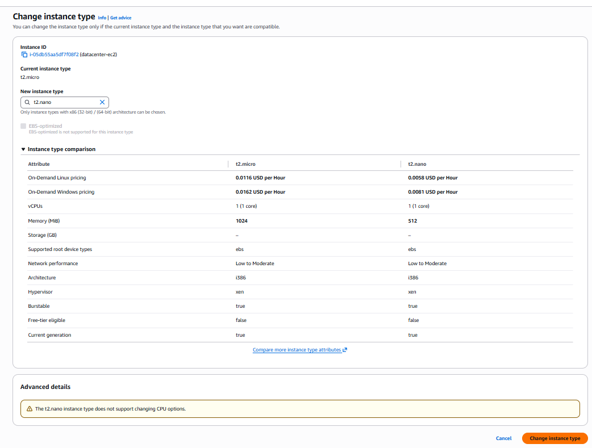
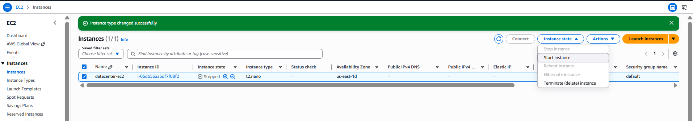
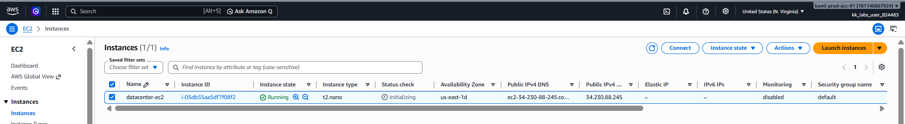

# Day 7: Change EC2 Instance Type

## Introduction

### What is an EC2 Instance Type?

An **EC2 Instance Type** defines the hardware resources allocated to an Amazon EC2 instance, including:

- Number of virtual CPUs (vCPUs)
- Memory (RAM)
- Network performance
- Storage performance

AWS provides different instance types for various workloads, allowing you to choose the right balance of performance and cost.

---

### Why Change an Instance Type?

Changing the instance type allows you to:

- Reduce infrastructure costs for underutilized servers.
- Increase CPU or memory for demanding workloads.
- Improve application performance.
- Scale resources without creating a new EC2 instance.

In this task, the instance is **underutilized**, so its instance type will be downgraded from **t2.micro** to **t2.nano** to optimize costs.

---

### Important Note

Before modifying an EC2 instance:

- Ensure the **Status Checks** have completed successfully.
- If the instance is still in the **Initializing** state, wait until both status checks pass.
- The instance must be **stopped** before changing its instance type.

---

# Task

Perform the following tasks:

1. Change the instance type of **`datacenter-ec2`** from **`t2.micro`** to **`t2.nano`**.
2. Ensure the instance is in the **Running** state after the change.

---

# Steps

## Step 1: Open the EC2 Console

Navigate to the AWS Management Console.

Go to:

**Services → EC2 → Instances**

Locate the instance:

```
datacenter-ec2
```

---

## Step 2: Verify the Instance Status Checks

Before making any changes, verify that the instance has completed its status checks.

Under the **Status Check** column, ensure the status shows:

```text
2/2 checks passed
```

> **Note:** If the instance is still in the **Initializing** state, wait until both checks have passed before proceeding.

---

## Step 3: Stop the EC2 Instance

Since the instance type cannot be modified while the instance is running, stop the instance first.

1. Select the **datacenter-ec2** instance.
2. Click **Instance State**.
3. Choose **Stop instance**.
4. Wait until the instance state changes to:

```text
Stopped
```


> **Note:** Stopping an EBS-backed EC2 instance does not delete the instance or its attached EBS volumes. However, the public IPv4 address (if not an Elastic IP) may change when the instance is started again.

---

## Step 4: Change the Instance Type

With the instance in the **Stopped** state:

1. Select the instance.
2. Click **Actions**.
3. Navigate to:

```
Instance Settings → Change Instance Type
```

Choose:

| Setting | Value |
|----------|-------|
| Current Type | `t2.micro` |
| New Type | `t2.nano` |

Click **Apply** or **Save** to update the instance type.



---

## Step 5: Start the EC2 Instance

Start the instance again.

1. Select the instance.
2. Click **Instance State**.
3. Choose **Start instance**.

Wait until the instance state changes to:

```text
Running
```



---

## Step 6: Verify the Changes

Confirm the following:

| Property | Expected Value |
|----------|----------------|
| Instance Name | `datacenter-ec2` |
| Instance State | Running |
| Instance Type | `t2.nano` |
| Status Checks | 2/2 checks passed |

The task is complete once the instance is running with the new instance type.

---

# Things to Remember

- An EC2 instance **must be stopped** before changing its instance type.
- Wait for **2/2 Status Checks Passed** before stopping or starting the instance.
- Changing the instance type does **not** delete the instance or its data stored on attached EBS volumes.
- A new public IPv4 address may be assigned after restarting the instance unless an Elastic IP is associated.

---

# Key Learnings

After completing this exercise, you should understand:

- What an EC2 instance type is and how it affects CPU, memory, and performance.
- Why organizations change instance types to optimize cost and resource utilization.
- How to verify EC2 status checks before performing maintenance.
- Why an EC2 instance must be stopped before modifying its instance type.
- How to safely stop and start an EC2 instance.
- How to change an EC2 instance type using the AWS Management Console.
- How to verify that the instance is running successfully after the modification.
- The difference between an EC2 instance's **State** (Running/Stopped) and its **Status Checks** (Initializing/2 of 2 checks passed).

