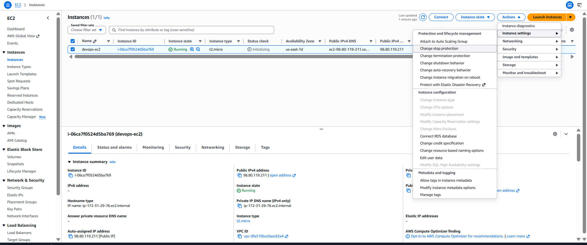
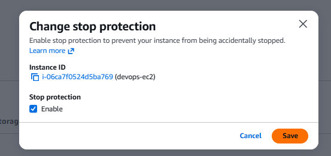

# Day 8: Enable Stop Protection for an EC2 Instance

## Introduction

### What is Stop Protection?

**Stop Protection** is an Amazon EC2 feature that prevents an instance from being accidentally stopped through the AWS Management Console, AWS CLI, or API.

When Stop Protection is enabled, any attempt to stop the instance is blocked until the protection is disabled.

This feature is useful for protecting production or critical instances from unintended downtime caused by human error or automation scripts.

> **Note:** Stop Protection only prevents an instance from being **stopped**. It does **not** prevent the instance from being **terminated**.

---

## Why is Stop Protection Needed?

In cloud environments, administrators and automation scripts frequently manage EC2 instances.

Accidentally stopping a critical server can lead to:

- Application downtime
- Service interruptions
- Failed deployments
- Lost user connectivity
- Business impact

Enabling Stop Protection helps safeguard important instances by preventing accidental stop operations.

For complete protection, AWS also provides **Termination Protection**, which prevents accidental deletion of an EC2 instance.

---

## Stop Protection vs. Termination Protection

| Feature | Stop Protection | Termination Protection |
|----------|-----------------|-------------------------|
| Prevents Stopping | ✅ Yes | ❌ No |
| Prevents Termination | ❌ No | ✅ Yes |
| Protects Against Accidental Downtime | ✅ Yes | Partially |
| Protects Against Deletion | ❌ No | ✅ Yes |

---

# Task

There is an EC2 instance named **`devops-ec2`** in the **`us-east-1`** region.

Enable **Stop Protection** for this instance.

---

# Steps (AWS Management Console)

## Step 1: Open the EC2 Console

Sign in to the **AWS Management Console**.

Navigate to:

**Services → EC2 → Instances**

Ensure you are in the **us-east-1** region.

---

## Step 2: Locate the EC2 Instance

Find the instance named:

```text
devops-ec2
```

Select the instance.

---

## Step 3: Enable Stop Protection

With the instance selected:

1. Click **Actions**.
2. Navigate to:

```
Instance Settings → Change Stop Protection
```


3. Select:

```text
Enable
```


4. Click **Save**.

AWS will confirm that Stop Protection has been enabled successfully.

---

## Step 4: Verify Stop Protection

Select the instance.

Open the **Details** tab and verify that:

```text
Stop Protection: Enabled
```

The instance is now protected from accidental stop operations.

---

# Using the AWS CLI

You can also enable Stop Protection using the AWS CLI.

First, obtain the instance ID.

```sh
aws ec2 describe-instances \
    --filters "Name=tag:Name,Values=devops-ec2" \
    --region us-east-1
```

Enable Stop Protection:

```sh
aws ec2 modify-instance-attribute \
    --instance-id <INSTANCE_ID> \
    --disable-api-stop \
    --value true \
    --region us-east-1
```

Replace `<INSTANCE_ID>` with the actual EC2 instance ID.

---

## Enable Termination Protection (Optional)

To protect the instance from accidental deletion, enable **Termination Protection**:

```sh
aws ec2 modify-instance-attribute \
    --instance-id <INSTANCE_ID> \
    --disable-api-termination \
    --value true \
    --region us-east-1
```

---

## Verify Stop Protection Using the AWS CLI

You can verify whether Stop Protection is enabled by describing the instance attributes:

```sh
aws ec2 describe-instance-attribute \
    --instance-id <INSTANCE_ID> \
    --attribute disableApiStop \
    --region us-east-1
```

Expected output:

```json
{
    "DisableApiStop": {
        "Value": true
    }
}
```

---

# Things to Remember

- Stop Protection prevents accidental **Stop** operations.
- It does **not** prevent instance termination.
- Termination Protection is a separate feature.
- Stop Protection can be enabled or disabled at any time.
- You must have the required IAM permissions to modify instance attributes.

---

# Key Learnings

- What Stop Protection is and why it is used.
- The difference between Stop Protection and Termination Protection.
- How Stop Protection helps prevent accidental downtime.
- How to enable Stop Protection using the AWS Management Console.
- How to enable Stop Protection using the AWS CLI.
- How to verify that Stop Protection is enabled.
- The importance of protecting critical EC2 instances from accidental administrative actions.