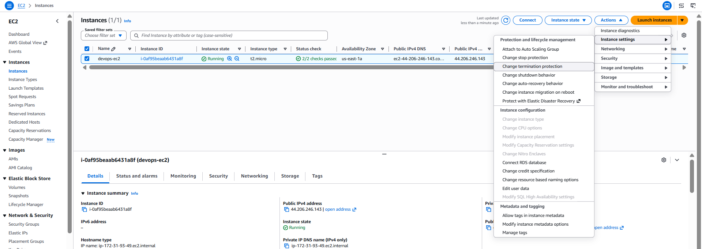
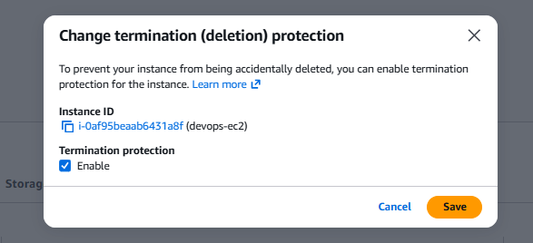

# Day 9: Enable Termination Protection for an EC2 Instance

## Introduction

### What is Termination Protection?

**Termination Protection** is an Amazon EC2 feature that prevents an instance from being **accidentally terminated** through the AWS Management Console, AWS CLI, or API.

When this feature is enabled, any attempt to terminate the instance is blocked until the protection is disabled.

> **Note:** Termination Protection only prevents **instance deletion**. It does **not** prevent the instance from being stopped, restarted, or rebooted.

---

## Why is Termination Protection Needed?

In cloud environments, EC2 instances may host critical applications, databases, or production services. Accidentally terminating such an instance can lead to:

- Service downtime
- Permanent loss of the instance
- Business disruption
- Time-consuming recovery efforts

Enabling Termination Protection adds an extra layer of safety by preventing accidental deletion of important EC2 instances.

---

## Stop Protection vs. Termination Protection

| Feature | Stop Protection | Termination Protection |
|----------|-----------------|-------------------------|
| Prevents Stop | ✅ Yes | ❌ No |
| Prevents Termination | ❌ No | ✅ Yes |
| Prevents Accidental Downtime | ✅ Yes | Partially |
| Prevents Accidental Deletion | ❌ No | ✅ Yes |

---

# Task

An EC2 instance named **`devops-ec2`** already exists in the **`us-east-1`** region.

Enable **Termination Protection** for this instance.

---

# Steps (AWS Management Console)

## Step 1: Open the EC2 Console

1. Sign in to the **AWS Management Console**.
2. Navigate to:

```
Services → EC2 → Instances
```

3. Ensure the selected AWS Region is:

```
us-east-1
```

---

## Step 2: Locate the EC2 Instance

Find and select the instance named:

```text
devops-ec2
```

---

## Step 3: Enable Termination Protection

With the instance selected:

1. Click **Actions**.
2. Navigate to:

```
Instance Settings → Change Termination Protection
```


3. Select:

```text
Enable
```

4. Click **Save**.

AWS will display a confirmation message indicating that Termination Protection has been enabled.


---

## Step 4: Verify the Configuration

Select the instance and open the **Details** tab.

Verify that the following attribute is displayed:

```text
Termination Protection: Enabled
```

This confirms that the instance is protected from accidental termination.

---

# Using the AWS CLI

You can also enable Termination Protection using the AWS CLI.

First, identify the instance ID:

```sh
aws ec2 describe-instances \
    --filters "Name=tag:Name,Values=devops-ec2" \
    --region us-east-1
```

Enable Termination Protection:

```sh
aws ec2 modify-instance-attribute \
    --instance-id <INSTANCE_ID> \
    --disable-api-termination \
    --value true \
    --region us-east-1
```

Replace `<INSTANCE_ID>` with the actual EC2 instance ID.

---

## Verify Using the AWS CLI

Run the following command:

```sh
aws ec2 describe-instance-attribute \
    --instance-id <INSTANCE_ID> \
    --attribute disableApiTermination \
    --region us-east-1
```

Expected output:

```json
{
    "DisableApiTermination": {
        "Value": true
    }
}
```

---

# Things to Remember

- Termination Protection prevents **accidental deletion** of an EC2 instance.
- It does **not** prevent stopping, rebooting, or restarting the instance.
- Stop Protection and Termination Protection are two separate features and can be enabled independently.
- You must disable Termination Protection before permanently deleting the instance.

---

# Key Learnings

- Learned how Termination Protection safeguards EC2 instances from accidental deletion.
- Understood the difference between Stop Protection and Termination Protection.
- Learned how to enable Termination Protection using both the AWS Management Console and the AWS CLI.
- Learned how to verify that Termination Protection is enabled before performing administrative operations.