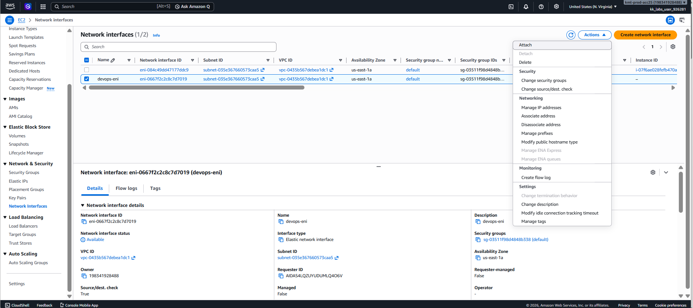
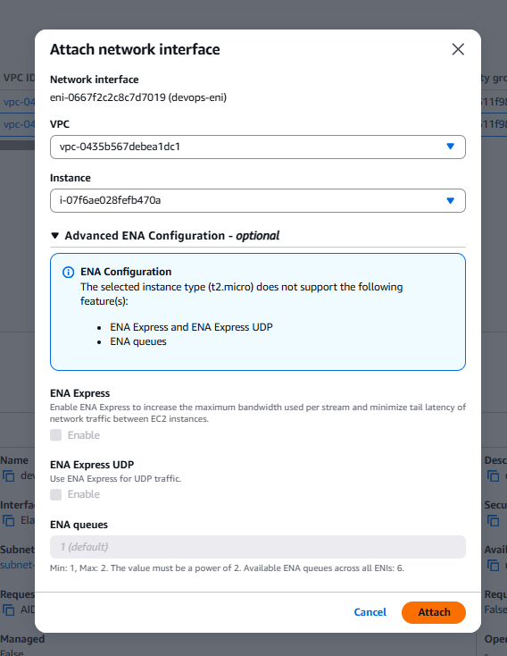

# Day 11: Attach an Elastic Network Interface (ENI) to an EC2 Instance

## Introduction

### What is an Elastic Network Interface (ENI)?

An **Elastic Network Interface (ENI)** is a virtual network card that can be attached to an Amazon EC2 instance. It enables network connectivity between the instance and the Virtual Private Cloud (VPC).

An ENI contains networking information such as:

- Private IPv4 address
- Public IPv4 address (if assigned)
- IPv6 addresses
- MAC address
- Security Groups
- Elastic IP association (optional)

Unlike the primary network interface, an ENI can be detached from one EC2 instance and attached to another within the same Availability Zone.

---

## Why is an ENI Needed?

By default, every EC2 instance is launched with a **primary network interface (eth0)**.

Additional ENIs are useful when an instance requires multiple network interfaces for different workloads or network configurations.

Common use cases include:

- Separating public and private network traffic.
- Running multiple applications with different security groups.
- High Availability (HA) and failover between EC2 instances.
- Migrating network configurations between instances.
- Network appliances such as firewalls, routers, and proxies.

Since an ENI retains its IP addresses and security groups, it can be moved between compatible EC2 instances without reconfiguring networking.

---

# Task

An EC2 instance named **`devops-ec2`** and an Elastic Network Interface named **`devops-eni`** already exist in the **`us-east-1`** region.

Perform the following:

- Attach the **`devops-eni`** network interface to the **`devops-ec2`** instance.
- Ensure the ENI status is **Attached** before submitting the task.
- Ensure the EC2 instance has completed initialization (Status Checks: **2/2 checks passed**) before making changes.

---

# Steps (AWS Management Console)

## Step 1: Open the EC2 Console

1. Sign in to the **AWS Management Console**.
2. Navigate to:

```
Services → EC2
```

3. Select the AWS Region:

```
us-east-1
```

---

## Step 2: Verify the EC2 Instance

Navigate to:

```
EC2 → Instances
```

Locate the instance:

```text
devops-ec2
```

Verify:

- Instance State:

```text
Running
```

- Status Checks:

```text
2/2 checks passed
```

> **Note:** If the instance is still in the **Initializing** state, wait until both status checks have passed before proceeding.

---

## Step 3: Locate the Elastic Network Interface

From the left navigation pane, select:

```
Network & Security → Network Interfaces
```

Locate the ENI named:

```text
devops-eni
```

Verify its status is:

```text
Available
```

This indicates it is ready to be attached.

---

## Step 4: Attach the ENI

1. Select the **`devops-eni`** network interface.
2. Click **Actions**.
3. Choose:

```
Attach
```



Configure the following:

| Setting | Value |
|----------|-------|
| Instance | `devops-ec2` |
| Device Index | `1` |

> **Note:** Device Index **0** is reserved for the primary network interface (`eth0`). Additional ENIs should typically use **Device Index 1** or higher.

Click **Attach**.


---

## Step 5: Verify the Attachment

After the attachment completes, verify the following:

| Property | Expected Value |
|----------|----------------|
| Status | Attached |
| Attached Instance | `devops-ec2` |
| Device Index | 1 |

The task is complete once the ENI status changes to:

```text
Attached
```

---

# Using the AWS CLI (Optional)

## Find the Network Interface

```sh
aws ec2 describe-network-interfaces \
    --region us-east-1
```

Locate the **NetworkInterfaceId** of **`devops-eni`**.

---

## Find the Instance ID

```sh
aws ec2 describe-instances \
    --filters "Name=tag:Name,Values=devops-ec2" \
    --region us-east-1
```

---

## Attach the ENI

```sh
aws ec2 attach-network-interface \
    --network-interface-id <NETWORK_INTERFACE_ID> \
    --instance-id <INSTANCE_ID> \
    --device-index 1 \
    --region us-east-1
```

Replace:

- `<NETWORK_INTERFACE_ID>` with the ENI ID.
- `<INSTANCE_ID>` with the EC2 instance ID.

---

## Verify the Attachment

```sh
aws ec2 describe-network-interfaces \
    --network-interface-ids <NETWORK_INTERFACE_ID> \
    --region us-east-1
```

The output should show:

```text
Status: in-use
Attachment:
    Status: attached
```

---

# Things to Remember

- Every EC2 instance has one **primary ENI** attached at launch.
- Additional ENIs must use **Device Index 1 or higher**.
- An ENI can only be attached to one EC2 instance at a time.
- An ENI and the EC2 instance must be in the **same Availability Zone**.
- Wait for the EC2 instance to complete initialization (**2/2 status checks passed**) before performing attachment operations.

---

# Key Learnings

- Learned what an Elastic Network Interface (ENI) is and how it differs from the primary network interface.
- Understood common use cases for attaching multiple network interfaces to an EC2 instance.
- Learned how to attach an ENI to an EC2 instance using the AWS Management Console and AWS CLI.
- Learned how to verify that the ENI is successfully attached and in the **Attached** state.