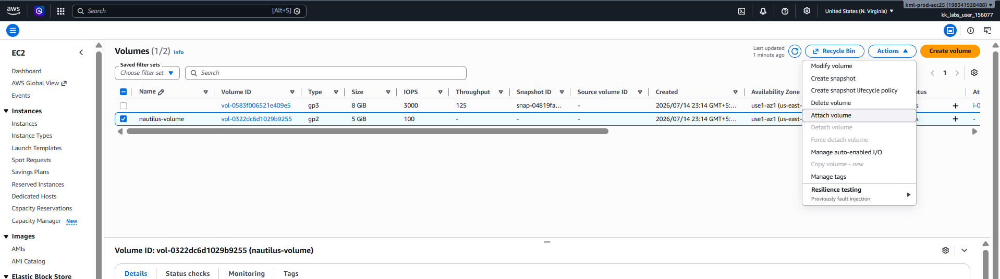
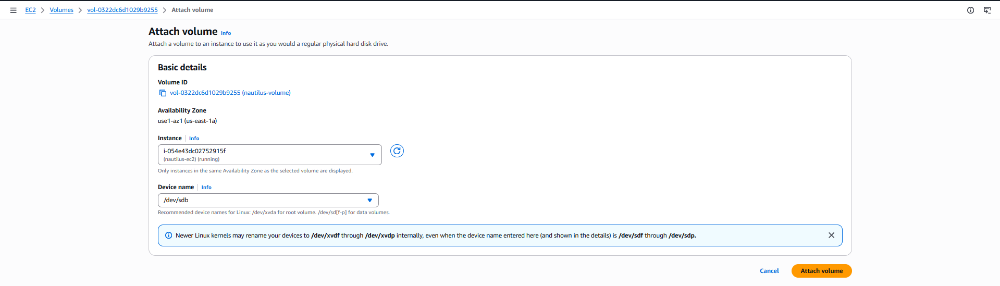

# Day 12: Attach an Amazon EBS Volume to an EC2 Instance

## Introduction

### What is Amazon EBS?

**Amazon Elastic Block Store (Amazon EBS)** is a durable block storage service designed for use with Amazon EC2 instances. It provides persistent storage that behaves like a physical hard drive attached to a virtual server.

Unlike the instance's temporary (ephemeral) storage, data stored on an EBS volume persists even if the EC2 instance is stopped or restarted.

---

## Why are EBS Volumes Needed?

An EBS volume allows you to add additional storage to an EC2 instance without replacing or recreating the instance.

Common use cases include:

- Expanding storage for applications
- Storing databases
- Hosting application logs
- Storing backups
- Separating operating system files from application data
- Attaching existing data volumes to another EC2 instance during recovery or migration

Because EBS volumes are independent AWS resources, they can be detached from one EC2 instance and attached to another (within the same Availability Zone).

---

## Understanding Device Names

When attaching an EBS volume, AWS requires a **device name**, which specifies how the operating system identifies the attached storage device.

Examples include:

```text
/dev/sdb
/dev/sdc
/dev/xvdf
```

> **Note:** The actual device name inside the operating system may differ slightly depending on the Linux distribution and virtualization type (for example, `/dev/xvdb` or `/dev/nvme1n1`).

---

# Task

An EC2 instance named **`nautilus-ec2`** and an Amazon EBS volume named **`nautilus-volume`** already exist in the **`us-east-1`** region.

Attach the **`nautilus-volume`** volume to the **`nautilus-ec2`** instance.

While attaching the volume, set the **Device Name** to:

```text
/dev/sdb
```

---

# Steps (AWS Management Console)

## Step 1: Open the EC2 Console

1. Sign in to the **AWS Management Console**.
2. Navigate to:

```text
Services → EC2
```

3. Ensure the selected AWS Region is:

```text
us-east-1
```

---

## Step 2: Verify the EC2 Instance

Navigate to:

```text
EC2 → Instances
```

Locate the instance:

```text
nautilus-ec2
```

Ensure the instance is in the **Running** state.

---

## Step 3: Locate the EBS Volume

From the left navigation pane, select:

```text
Elastic Block Store → Volumes
```

Locate the volume named:

```text
nautilus-volume
```

Verify that its status is:

```text
Available
```

---

## Step 4: Attach the Volume

1. Select the **`nautilus-volume`**.
2. Click **Actions**.
3. Select:

```text
Attach Volume
```



Configure the following:

| Setting | Value |
|----------|-------|
| Instance | `nautilus-ec2` |
| Device Name | `/dev/sdb` |

Click **Attach Volume**.



---

## Step 5: Verify the Attachment

After the operation completes, verify the following:

| Property | Expected Value |
|----------|----------------|
| Volume Status | In use |
| Attached Instance | `nautilus-ec2` |
| Device Name | `/dev/sdb` |

The task is complete once the volume status changes to:

```text
In use
```

---

# Using the AWS CLI (Optional)

## Find the Volume ID

```sh
aws ec2 describe-volumes \
    --filters "Name=tag:Name,Values=nautilus-volume" \
    --region us-east-1
```

---

## Find the EC2 Instance ID

```sh
aws ec2 describe-instances \
    --filters "Name=tag:Name,Values=nautilus-ec2" \
    --region us-east-1
```

---

## Attach the Volume

```sh
aws ec2 attach-volume \
    --volume-id <VOLUME_ID> \
    --instance-id <INSTANCE_ID> \
    --device /dev/sdb \
    --region us-east-1
```

Replace:

- `<VOLUME_ID>` with the EBS Volume ID.
- `<INSTANCE_ID>` with the EC2 Instance ID.

---

## Verify the Attachment

```sh
aws ec2 describe-volumes \
    --volume-ids <VOLUME_ID> \
    --region us-east-1
```

Expected output:

```text
State: in-use
Attachment:
    Device: /dev/sdb
```

---

# Things to Remember

- An EBS volume and the EC2 instance **must be in the same Availability Zone**.
- A standard EBS volume can only be attached to **one EC2 instance at a time** (except Multi-Attach supported volumes).
- The device name specified during attachment may appear differently inside the Linux operating system.
- Attaching a volume does not automatically create a filesystem or mount it—you must format and mount it inside the operating system if you want to use it.

---

# Key Learnings

- Learned what Amazon EBS is and how it provides persistent block storage for EC2 instances.
- Understood why additional EBS volumes are attached to EC2 instances for application data, backups, and storage expansion.
- Learned how to attach an EBS volume to an EC2 instance using the AWS Management Console and AWS CLI.
- Learned the importance of specifying the correct device name and verifying that the volume status changes to **In use** after attachment.