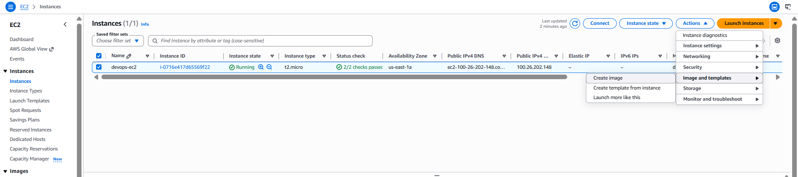
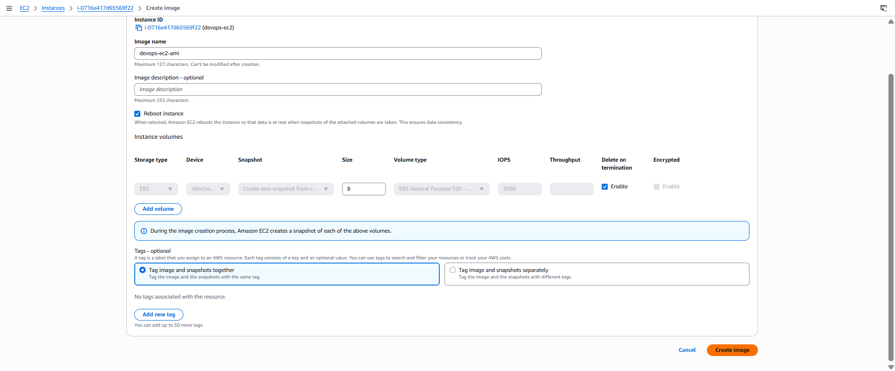
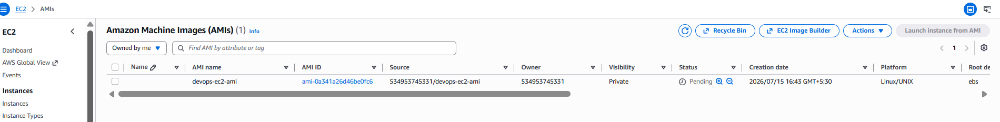
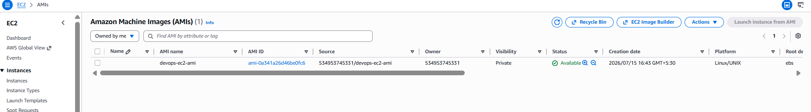

# Day 13: Create an Amazon Machine Image (AMI) from an EC2 Instance

## Introduction

### What is an Amazon Machine Image (AMI)?

An **Amazon Machine Image (AMI)** is a pre-configured template used to launch Amazon EC2 instances. It contains everything required to create a new instance, including:

- Operating System
- Installed software and applications
- Configuration settings
- EBS snapshots (if applicable)

An AMI acts as a reusable blueprint, allowing you to launch multiple EC2 instances with the same configuration.

---

## Why are AMIs Needed?

Creating an AMI enables you to preserve the current state of an EC2 instance and reuse it whenever required.

Common use cases include:

- Creating backups before major system changes.
- Launching identical EC2 instances.
- Disaster recovery.
- Auto Scaling Groups.
- Environment replication (Development, Testing, Production).
- Faster deployment of pre-configured servers.

Instead of manually installing and configuring software on every new instance, an AMI allows you to deploy identical environments within minutes.

---

## How an AMI Works

```text
Existing EC2 Instance
        │
        ▼
Create Image (AMI)
        │
        ▼
AWS Creates EBS Snapshot(s)
        │
        ▼
AMI Available
        │
        ▼
Launch New EC2 Instances
```

When an AMI is created from an EBS-backed instance, AWS automatically creates snapshots of the attached EBS volumes and registers the AMI.

---

# Task

Create an AMI from the existing EC2 instance:

```text
devops-ec2
```

Requirements:

| Setting | Value |
|----------|-------|
| EC2 Instance | `devops-ec2` |
| AMI Name | `devops-ec2-ami` |
| Region | `us-east-1` |
| Final State | Available |

---

# Steps (AWS Management Console)

## Step 1: Open the EC2 Console

1. Sign in to the **AWS Management Console**.
2. Navigate to:

```text
Services → EC2
```

3. Ensure the selected AWS Region is:

```text
us-east-1
```

---

## Step 2: Locate the EC2 Instance

Navigate to:

```text
EC2 → Instances
```

Locate the instance:

```text
devops-ec2
```

Ensure the instance is in the **Running** or **Stopped** state.

> **Note:** An AMI can be created from both running and stopped instances. However, creating an AMI from a stopped instance provides greater filesystem consistency.

---

## Step 3: Create the AMI

1. Select the **`devops-ec2`** instance.
2. Click **Actions**.
3. Navigate to:

```text
Image and templates → Create image
```



Configure the following:

| Setting | Value |
|----------|-------|
| Image Name | `devops-ec2-ami` |
| Image Description | *(Optional)* |

Leave the remaining settings as default.

Click:

```text
Create Image
```


AWS begins creating snapshots of the attached EBS volumes and registers the AMI.

---

## Step 4: Monitor AMI Creation

Navigate to:

```text
EC2 → Images → AMIs
```

Locate:

```text
devops-ec2-ami
```

Initially, the AMI status will be:

```text
Pending
```



Wait until the status changes to:

```text
Available
```



The task is complete once the AMI reaches the **Available** state.

---

# Using the AWS CLI (Optional)

## Find the Instance ID

```sh
aws ec2 describe-instances \
    --filters "Name=tag:Name,Values=devops-ec2" \
    --region us-east-1
```

---

## Create the AMI

```sh
aws ec2 create-image \
    --instance-id <INSTANCE_ID> \
    --name "devops-ec2-ami" \
    --region us-east-1
```

Replace:

- `<INSTANCE_ID>` with the EC2 instance ID.

The command returns an **ImageId**.

---

## Verify the AMI Status

```sh
aws ec2 describe-images \
    --image-ids <IMAGE_ID> \
    --region us-east-1
```

Expected output:

```text
State: available
```

---

# Things to Remember

- Creating an AMI automatically creates snapshots of all attached EBS volumes.
- The AMI cannot be used until its state changes from **Pending** to **Available**.
- An AMI serves as a reusable template for launching new EC2 instances.
- Creating an AMI does **not** modify or stop the existing EC2 instance (unless configured otherwise).

---

# Key Learnings

- Learned what an Amazon Machine Image (AMI) is and how it serves as a reusable template for EC2 instances.
- Understood the importance of AMIs for backups, disaster recovery, and launching identical servers.
- Learned how to create an AMI from an existing EC2 instance using the AWS Management Console and AWS CLI.
- Learned how to monitor the AMI creation process and verify that it reaches the **Available** state before use.