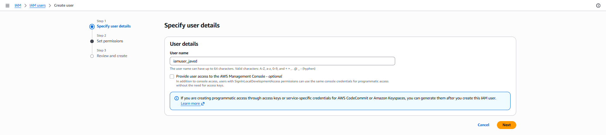
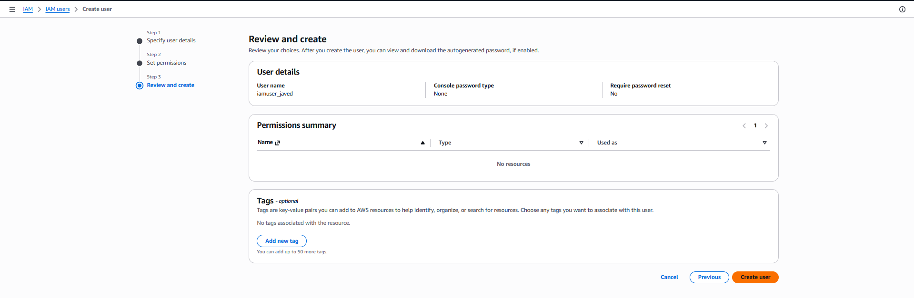
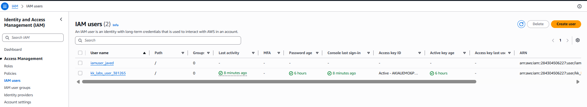

# Day 15: Create an IAM User

## Introduction

### What is AWS Identity and Access Management (IAM)?

**AWS Identity and Access Management (IAM)** is a web service that helps you securely manage access to AWS resources. It allows you to control **who can access AWS**, **what resources they can access**, and **what actions they are allowed to perform**.

IAM is one of the first services configured in an AWS environment because it provides the foundation for authentication and authorization across AWS services.

---

## Why is IAM Needed?

IAM enables organizations to securely manage users and permissions without sharing the AWS root account credentials.

Common use cases include:

- Creating individual user accounts for team members.
- Granting least-privilege access to AWS resources.
- Managing permissions through groups and policies.
- Providing temporary access using IAM roles.
- Enhancing security with Multi-Factor Authentication (MFA).
- Auditing user activities using AWS CloudTrail.

Using IAM helps organizations maintain security, accountability, and compliance while working in the AWS Cloud.

---

## IAM Components

AWS IAM consists of several key components:

| Component | Description |
|-----------|-------------|
| **Users** | Individual identities that can sign in to AWS. |
| **Groups** | Collections of IAM users with shared permissions. |
| **Roles** | Temporary identities assumed by users or AWS services. |
| **Policies** | JSON documents that define permissions. |
| **MFA** | Adds an extra layer of authentication for enhanced security. |

---

## How IAM Works

```text
Administrator
      │
      ▼
Create IAM User
      │
      ▼
Attach Permissions
      │
      ▼
User Signs In
      │
      ▼
Access AWS Resources
```

---

# Task

Create an IAM user with the following details:

| Setting | Value |
|----------|-------|
| User Name | `iamuser_javed` |

No additional permissions, groups, or policies are required unless specified.

---

# Steps (AWS Management Console)

## Step 1: Open the IAM Console

1. Sign in to the **AWS Management Console**.
2. Navigate to:

```text
Services → IAM
```

---

## Step 2: Navigate to Users

From the left navigation pane, select:

```text
Users
```

Click:

```text
Create user
```

---

## Step 3: Configure the User

Enter the following details:

| Setting | Value |
|----------|-------|
| User name | `iamuser_javed` |

Leave the remaining options at their default values unless the task specifies otherwise.

Click:

```text
Next
```


---

## Step 4: Set Permissions

Since the task only requires creating the IAM user:

- Do **not** attach any policies or groups.
- Leave the permissions unchanged.

Click:

```text
Next
```


---

## Step 5: Review and Create

Review the user details.

Click:

```text
Create user
```

You should see a confirmation message indicating that the IAM user has been created successfully.



---

## Step 6: Verify the User

Navigate back to:

```text
IAM → Users
```

Verify that the following user exists:

```text
iamuser_javed
```

The task is complete once the user appears in the IAM Users list.



---

# Using the AWS CLI (Optional)

## Create the IAM User

```sh
aws iam create-user \
    --user-name iamuser_javed
```

---

## Verify the User

```sh
aws iam get-user \
    --user-name iamuser_javed
```

Expected output:

```text
UserName: iamuser_javed
```

---

## List All IAM Users

```sh
aws iam list-users
```

This command displays all IAM users in the AWS account.

---

# Things to Remember

- IAM is a **global AWS service**, so it is **not tied to a specific AWS Region**.
- Every AWS account has a **root user**, but it should only be used for account-level administrative tasks.
- IAM users should be granted only the permissions they need by following the **Principle of Least Privilege**.
- Permissions are assigned using **IAM Policies**, either directly or through groups and roles.
- Creating an IAM user alone does **not** grant any access to AWS resources until permissions are attached.

---

# Key Learnings

- Learned the purpose of AWS Identity and Access Management (IAM) and its role in securing AWS resources.
- Understood the difference between IAM users, groups, roles, and policies.
- Learned how to create an IAM user using both the AWS Management Console and the AWS CLI.
- Learned that IAM is a global service and that newly created users require permissions before they can access AWS resources.
- Understood the importance of following the Principle of Least Privilege when managing user access.