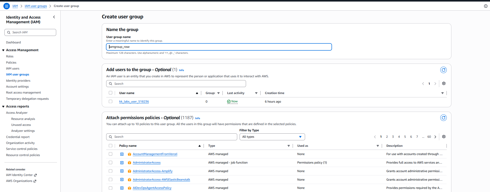
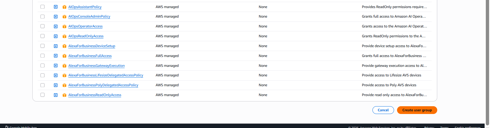
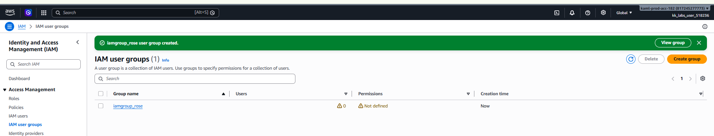

# Day 16: Create an IAM Group

## Introduction

### What is an IAM Group?

An **AWS Identity and Access Management (IAM) Group** is a collection of IAM users. Instead of assigning permissions to each user individually, you can assign permissions to a group, and every user in that group automatically inherits those permissions.

IAM Groups simplify permission management, especially in organizations with multiple users performing similar roles.

---

## Why are IAM Groups Needed?

Managing permissions individually for every user becomes difficult as an organization grows. IAM Groups help administrators manage access more efficiently by grouping users based on their job roles or responsibilities.

Common use cases include:

- Assigning the same permissions to multiple users.
- Simplifying user management.
- Implementing Role-Based Access Control (RBAC).
- Reducing administrative overhead.
- Enforcing the Principle of Least Privilege.

For example:

| Group | Members | Typical Permissions |
|--------|---------|---------------------|
| Developers | Software Developers | EC2, S3, CodeCommit |
| DevOps | DevOps Engineers | EC2, VPC, IAM, CloudFormation |
| Finance | Finance Team | Billing, Cost Explorer |
| ReadOnly | Auditors | Read-only access to AWS resources |

---

## How IAM Groups Work

```text
Administrator
        │
        ▼
Create IAM Group
        │
        ▼
Attach IAM Policy
        │
        ▼
Add IAM Users
        │
        ▼
Users Inherit Permissions
```

Instead of attaching policies to every user, permissions are attached to the group, making management much easier.

---

# Task

Create an IAM group with the following details:

| Setting | Value |
|----------|-------|
| Group Name | `iamgroup_rose` |

No users or policies need to be added unless explicitly specified.

---

# Steps (AWS Management Console)

## Step 1: Open the IAM Console

1. Sign in to the **AWS Management Console**.
2. Navigate to:

```text
Services → IAM
```

---

## Step 2: Navigate to User Groups

From the left navigation pane, select:

```text
User groups
```

Click:

```text
Create group
```

---

## Step 3: Configure the Group

Enter the following details:

| Setting | Value |
|----------|-------|
| User Group Name | `iamgroup_rose` |



Do **not** add any users or attach any policies, as they are not required for this task.

Click:

```text
Create group
```


---

## Step 4: Verify the Group

Navigate back to:

```text
IAM → User groups
```

Verify that the following group exists:

```text
iamgroup_rose
```


The task is complete once the group appears in the IAM User Groups list.

---

# Using the AWS CLI (Optional)

## Create the IAM Group

```sh
aws iam create-group --group-name iamgroup_rose
```

---

## Verify the Group

```sh
aws iam get-group --group-name iamgroup_rose
```

---

## List All IAM Groups

```sh
aws iam list-groups
```

---

# Things to Remember

- IAM is a **global AWS service**, so IAM groups are available across all AWS Regions.
- IAM groups cannot be used to sign in to AWS; only IAM users can sign in.
- Permissions are assigned to groups by attaching IAM policies.
- Users inherit all permissions assigned to the groups they belong to.
- An IAM user can belong to multiple IAM groups.

---

# Key Learnings

- Learned what an IAM Group is and how it simplifies permission management in AWS.
- Understood how IAM Groups help implement Role-Based Access Control (RBAC).
- Learned how to create an IAM Group using both the AWS Management Console and the AWS CLI.
- Learned that IAM Groups themselves do not have login credentials; they are used only to organize users and manage permissions.
- Understood that attaching policies to groups is more efficient than assigning permissions to each user individually.