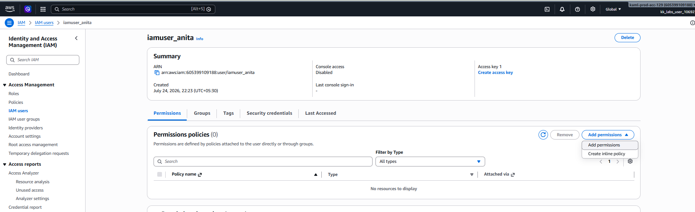
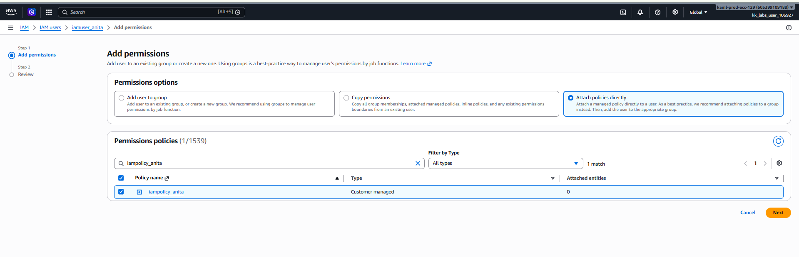
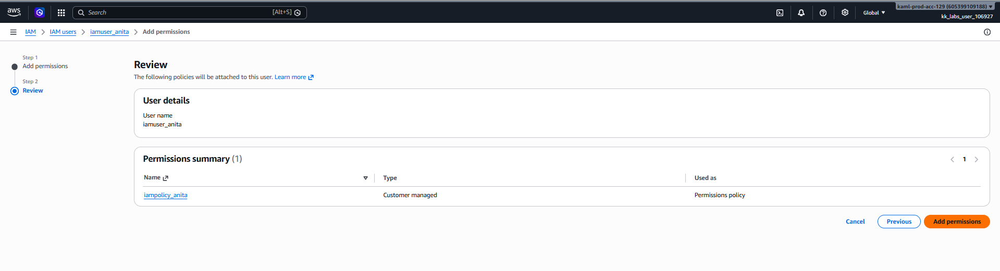
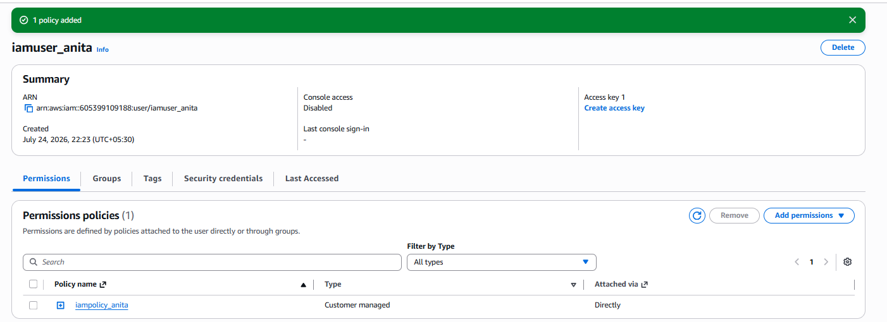
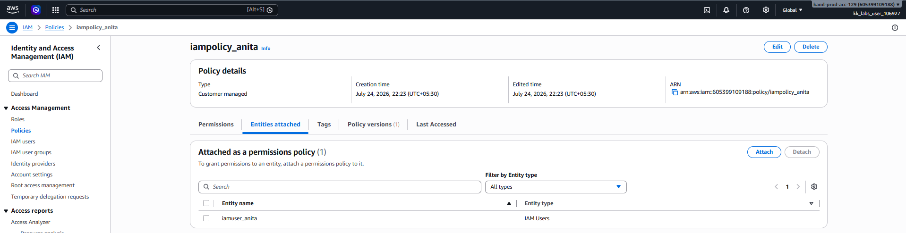

# Day 19: Attach an IAM Policy to an IAM User

## Introduction

### What is an IAM Policy Attachment?

An **IAM Policy Attachment** is the process of associating an IAM policy with an IAM identity, such as a **User**, **Group**, or **Role**. Once a policy is attached, the permissions defined in that policy become effective for the attached identity.

Attaching policies is a fundamental step in AWS Identity and Access Management (IAM), as it determines what actions users are allowed (or denied) to perform on AWS resources.

---

## Why Attach an IAM Policy?

Creating a user alone does **not** grant access to AWS resources. Permissions are only provided after attaching one or more IAM policies.

Common use cases include:

- Granting developers access to EC2 or S3.
- Allowing auditors to have read-only access.
- Providing administrators with full AWS access.
- Assigning permissions based on job roles.
- Enforcing the Principle of Least Privilege.

Instead of assigning permissions directly to every user, organizations often attach policies through IAM Groups or Roles for easier management.

---

## How IAM Policy Attachment Works

```text
Administrator
        │
        ▼
Create IAM Policy
        │
        ▼
Attach Policy
        │
        ▼
IAM User
        │
        ▼
User Receives Permissions
```

The attached policy defines what AWS actions the user can perform.

---

# Task

An IAM user named **`iamuser_anita`** and an IAM policy named **`iampolicy_anita`** already exist.

Attach the IAM policy **`iampolicy_anita`** to the IAM user **`iamuser_anita`**.

---

# Steps (AWS Management Console)

## Step 1: Open the IAM Console

1. Sign in to the **AWS Management Console**.
2. Navigate to:

```text
Services → IAM
```

---

## Step 2: Navigate to Users

From the left navigation pane, select:

```text
Users
```

Click on the user:

```text
iamuser_anita
```

---

## Step 3: Add Permissions

Open the:

```text
Permissions
```

tab.

Click:

```text
Add permissions
```


---

## Step 4: Attach the Existing Policy

Choose:

```text
Attach policies directly
```

Search for:

```text
iampolicy_anita
```

Select the checkbox next to:

```text
iampolicy_anita
```


Click:

```text
Next
```

Review the changes and click:

```text
Add permissions
```


---

## Step 5: Verify the Policy Attachment

Navigate to:

```text
IAM → Users → iamuser_anita → Permissions
```

Verify that the attached policy is:

```text
iampolicy_anita
```


The task is complete once the policy appears under the user's attached permissions.

Also check Policy to see if a user is added to that policy or not.



---

# Using the AWS CLI (Optional)

## Attach the Policy

First, retrieve the ARN of the policy if needed:

```sh
aws iam list-policies --scope Local
```

Then attach the policy to the user:

```sh
aws iam attach-user-policy --user-name iamuser_anita --policy-arn <POLICY_ARN>
```

Replace:

- `<POLICY_ARN>` with the ARN of **iampolicy_anita**.

Example:

```text
arn:aws:iam::123456789012:policy/iampolicy_anita
```

---

## Verify the Attachment

```sh
aws iam list-attached-user-policies --user-name iamuser_anita
```

Expected output:

```text
PolicyName: iampolicy_anita
```

---

# Things to Remember

- IAM is a **global AWS service**, so users and policies are available across all AWS Regions.
- Creating an IAM policy does **not** grant permissions until it is attached to a user, group, or role.
- A user can have multiple policies attached.
- AWS evaluates the combined permissions from all attached policies when authorizing requests.
- Using IAM Groups to manage permissions is recommended when multiple users require the same access.

---

# Key Learnings

- Learned what an IAM policy attachment is and why it is required to grant permissions.
- Understood that IAM users have no permissions until a policy is attached.
- Learned how to attach an existing IAM policy to an IAM user using the AWS Management Console.
- Learned how to attach and verify IAM policies using the AWS CLI.
- Understood that AWS evaluates all attached policies together when determining a user's effective permissions.