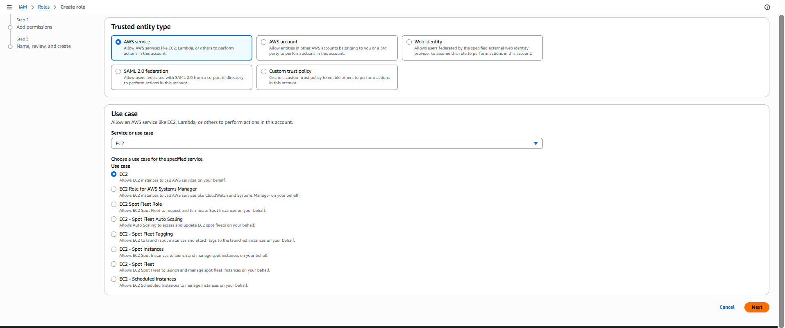
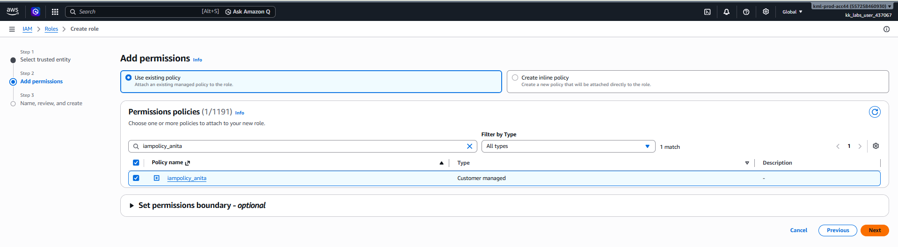
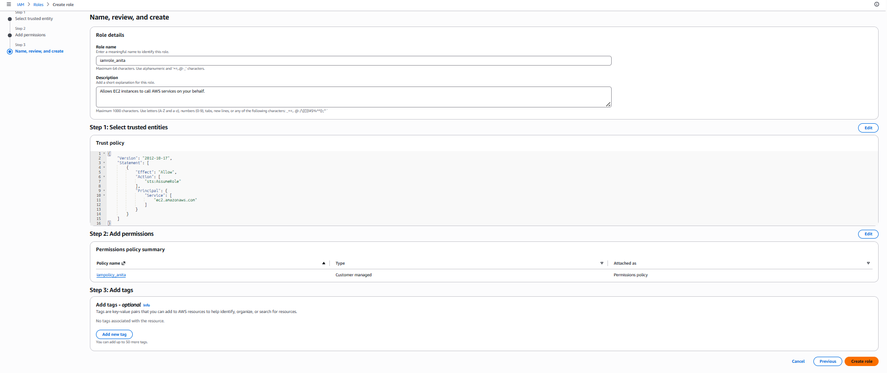
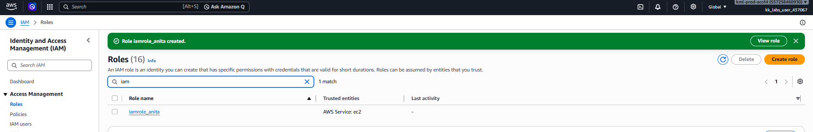

# Day 20: Create an IAM Role for EC2 with Policy Attachment

## Introduction

### What is an IAM Role?

An **AWS Identity and Access Management (IAM) Role** is an AWS identity that provides **temporary permissions** to trusted entities, such as AWS services, applications, or users.

Unlike an IAM User, an IAM Role **does not have long-term credentials (username/password or access keys)**. Instead, it is **assumed** by a trusted entity whenever access is required.

For example, an EC2 instance can assume an IAM role to securely access AWS resources such as Amazon S3, DynamoDB, or CloudWatch without storing AWS credentials on the instance.

---

## Why are IAM Roles Needed?

IAM Roles provide a secure way to grant temporary permissions without sharing or storing AWS credentials.

Common use cases include:

- Allowing EC2 instances to access AWS services.
- Granting Lambda functions permission to interact with AWS resources.
- Enabling cross-account access.
- Providing temporary access for applications.
- Improving security by eliminating hard-coded access keys.

IAM Roles follow AWS security best practices by using **temporary security credentials** provided through AWS Security Token Service (STS).

---

## IAM User vs IAM Role

| IAM User | IAM Role |
|----------|----------|
| Represents a person or application | Represents a set of permissions |
| Has permanent credentials | Uses temporary credentials |
| Can sign in to AWS | Cannot sign in directly |
| Used for long-term access | Used for temporary access |

---

## How IAM Roles Work

```text
Administrator
        │
        ▼
Create IAM Role
        │
        ▼
Select Trusted Entity
(EC2 Service)
        │
        ▼
Attach IAM Policy
        │
        ▼
Assign Role to EC2 Instance
        │
        ▼
EC2 Receives Temporary Credentials
```

---

# Task

Create an IAM Role with the following configuration:

| Setting | Value |
|----------|-------|
| Role Name | `iamrole_anita` |
| Trusted Entity | AWS Service |
| Use Case | EC2 |
| Attached Policy | `iampolicy_anita` |

---

# Steps (AWS Management Console)

## Step 1: Open the IAM Console

1. Sign in to the **AWS Management Console**.
2. Navigate to:

```text
Services → IAM
```

---

## Step 2: Navigate to Roles

From the left navigation pane, select:

```text
Roles
```

Click:

```text
Create role
```

---

## Step 3: Select the Trusted Entity

Configure the following:

| Setting | Value |
|----------|-------|
| Trusted Entity Type | AWS Service |
| Use Case | EC2 |

Click:

```text
Next
```


---

## Step 4: Attach the IAM Policy

Search for:

```text
iampolicy_anita
```

Select the checkbox next to:

```text
iampolicy_anita
```

Click:

```text
Next
```


---

## Step 5: Configure the Role

Enter:

| Setting | Value |
|----------|-------|
| Role Name | `iamrole_anita` |

(Optional) Add a description.

Click:

```text
Create role
```


---

## Step 6: Verify the Role

Navigate to:

```text
IAM → Roles
```

Open:

```text
iamrole_anita
```


Verify:

- Trusted entity is **EC2**
- Attached policy is **iampolicy_anita**

The task is complete once the role is successfully created with the required policy attached.

---

# Using the AWS CLI (Optional)

## Step 1: Create the Trust Policy

Create a file named:

```text
ec2-trust-policy.json
```

Paste the following JSON:

```json
{
  "Version": "2012-10-17",
  "Statement": [
    {
      "Effect": "Allow",
      "Principal": {
        "Service": "ec2.amazonaws.com"
      },
      "Action": "sts:AssumeRole"
    }
  ]
}
```

---

## Step 2: Create the IAM Role

```sh
aws iam create-role --role-name iamrole_anita --assume-role-policy-document file://ec2-trust-policy.json
```

---

## Step 3: Retrieve the Policy ARN

```sh
aws iam list-policies --scope Local
```

Locate the ARN for:

```text
iampolicy_anita
```

---

## Step 4: Attach the Policy

```sh
aws iam attach-role-policy --role-name iamrole_anita --policy-arn <POLICY_ARN>
```

Replace:

- `<POLICY_ARN>` with the ARN of **iampolicy_anita**.

Example:

```text
arn:aws:iam::123456789012:policy/iampolicy_anita
```

---

## Step 5: Verify the Role

```sh
aws iam get-role --role-name iamrole_anita
```

---

## Verify Attached Policies

```sh
aws iam list-attached-role-policies --role-name iamrole_anita
```

Expected output:

```text
PolicyName: iampolicy_anita
```

---

# Things to Remember

- IAM Roles are **global AWS resources** and are not tied to a specific AWS Region.
- IAM Roles use **temporary security credentials**, making them more secure than long-term access keys.
- Every IAM Role must have a **trusted entity** that is allowed to assume the role.
- For EC2 instances, the trusted entity is **ec2.amazonaws.com**.
- Permissions are granted by attaching IAM policies to the role.
- An IAM Role can have multiple policies attached.

---

# Key Learnings

- Learned what an IAM Role is and how it differs from an IAM User.
- Understood why IAM Roles are the recommended way to grant AWS permissions to EC2 instances.
- Learned how to create an IAM Role for the EC2 service using the AWS Management Console.
- Learned how to attach an existing IAM policy to an IAM Role.
- Learned how to create and manage IAM Roles using the AWS CLI.
- Understood the purpose of a trust policy and how it allows AWS services to assume an IAM Role.
