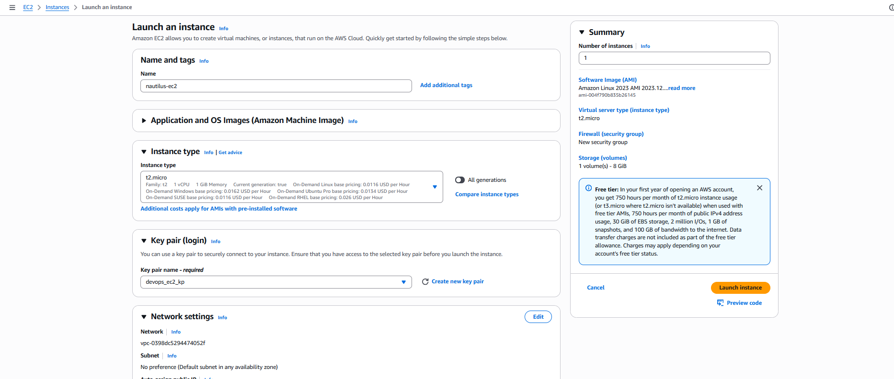
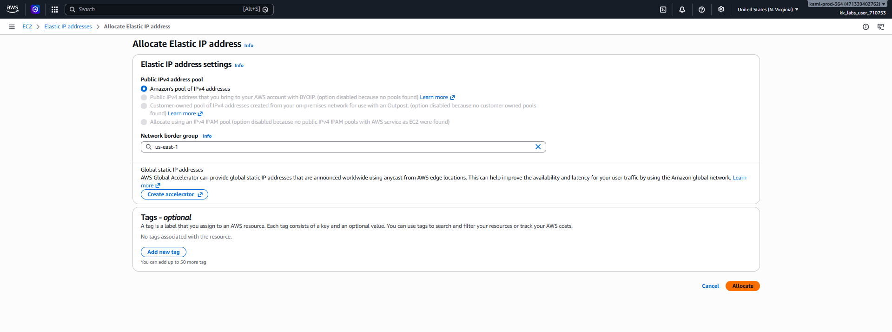
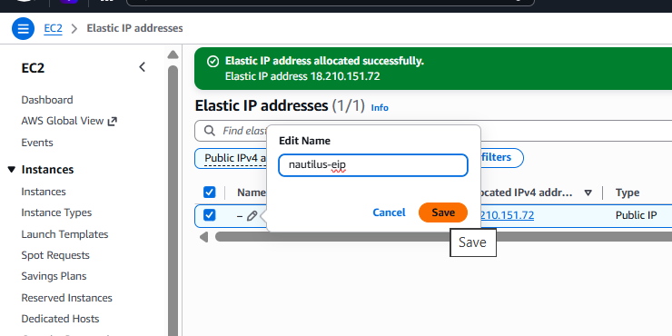
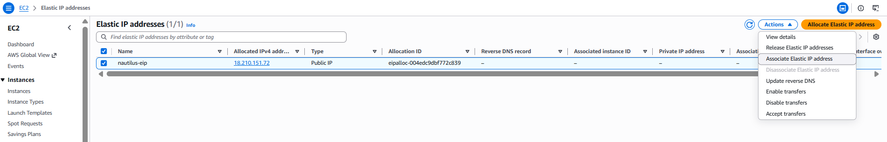
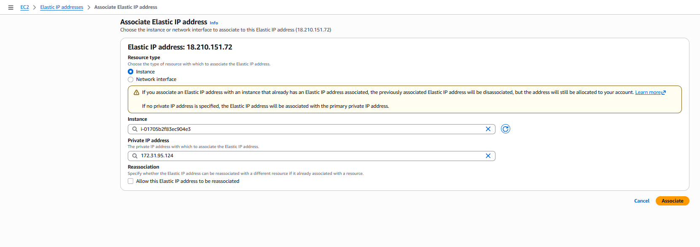
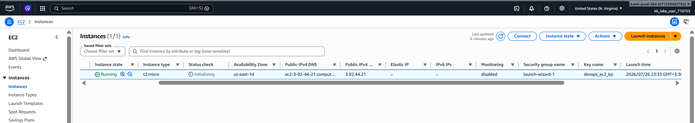
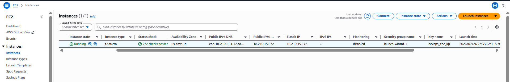

# Day 21: Setting Up an EC2 Instance with an Elastic IP for Application Hosting

## Introduction

### What is an Amazon EC2 Instance?

**Amazon Elastic Compute Cloud (Amazon EC2)** is a web service that provides secure, resizable virtual servers in the AWS Cloud. EC2 allows users to launch virtual machines with different operating systems, CPU, memory, and storage configurations based on application requirements.

EC2 instances are widely used for hosting web applications, APIs, databases, development environments, and enterprise workloads.

---

### What is an Elastic IP Address?

An **Elastic IP (EIP)** is a static public IPv4 address provided by AWS. Unlike the default public IP assigned to an EC2 instance, an Elastic IP remains associated with your AWS account until you explicitly release it.

If an EC2 instance is stopped or restarted, its default public IP may change. However, an Elastic IP remains constant, making it ideal for applications that require a permanent public address.

---

## Why Use an Elastic IP?

Elastic IPs provide a stable public IP address for applications that need uninterrupted external access.

Common use cases include:

- Hosting websites and web applications.
- Hosting APIs with a fixed endpoint.
- DNS mapping for production servers.
- Disaster recovery by moving the Elastic IP to another EC2 instance.
- Remote administration via SSH.

---

## How EC2 and Elastic IP Work

```text
Launch EC2 Instance
        │
        ▼
Temporary Public IP Assigned
        │
        ▼
Allocate Elastic IP
        │
        ▼
Associate Elastic IP
        │
        ▼
Static Public IP for Application
```

---

# Task

Create an EC2 instance and associate an Elastic IP with it.

| Setting | Value |
|----------|-------|
| Instance Name | `nautilus-ec2` |
| Operating System | Any Linux AMI (Ubuntu/Amazon Linux) |
| Instance Type | `t2.micro` |
| Elastic IP Name | `nautilus-eip` |

---

# Steps (AWS Management Console)

## Step 1: Open the EC2 Console

1. Sign in to the **AWS Management Console**.
2. Navigate to:

```text
Services → EC2
```

3. Ensure the selected Region is:

```text
us-east-1
```

---

## Step 2: Launch the EC2 Instance

Click:

```text
Launch Instance
```

Configure the following:

| Setting | Value |
|----------|-------|
| Name | `nautilus-ec2` |
| AMI | Ubuntu Server or Amazon Linux |
| Instance Type | `t2.micro` |
| Key Pair | Create or select an existing key pair |
| Network Settings | Leave default unless specified |

Click:

```text
Launch Instance
```


Wait until the instance reaches the **Running** state.

---

## Step 3: Allocate an Elastic IP

From the left navigation pane, select:

```text
Network & Security → Elastic IPs
```

Click:

```text
Allocate Elastic IP Address
```

Leave the default settings and click:

```text
Allocate
```

---

## Step 4: Add a Name Tag

Select the newly allocated Elastic IP.

Go to the **Tags** tab and click:

```text
Manage tags
```

Add the following tag:

| Key | Value |
|-----|-------|
| Name | `nautilus-eip` |

Click:

```text
Save
```

---

## Step 5: Associate the Elastic IP

With the Elastic IP selected, click:

```text
Actions → Associate Elastic IP Address
```


Configure:

| Setting | Value |
|----------|-------|
| Resource Type | Instance |
| Instance | `nautilus-ec2` |
| Private IP | Default |

Click:

```text
Associate
```

---

## Step 6: Verify the Configuration

Navigate to:

```text
EC2 → Instances
```

Open:

```text
nautilus-ec2
```

Verify:

- Instance state is **Running**
- Public IPv4 address matches the allocated Elastic IP

Navigate to:

```text
Network & Security → Elastic IPs
```

Verify:

| Property | Expected Value |
|----------|----------------|
| Name | `nautilus-eip` |
| Associated Resource | `nautilus-ec2` |

The task is complete once the Elastic IP is successfully associated with the EC2 instance.

Before associating Elastic IP:



After associating Elastic IP:



---

# Using the AWS CLI (Optional)

## Step 1: Launch the EC2 Instance

```sh
aws ec2 run-instances --image-id <AMI_ID> --instance-type t2.micro --tag-specifications "ResourceType=instance,Tags=[{Key=Name,Value=nautilus-ec2}]" --region us-east-1
```

Replace:

- `<AMI_ID>` with the desired Linux AMI ID.

---

## Step 2: Allocate an Elastic IP

```sh
aws ec2 allocate-address --domain vpc --region us-east-1
```

The command returns an **AllocationId**.

---

## Step 3: Tag the Elastic IP

```sh
aws ec2 create-tags --resources <ALLOCATION_ID> --tags Key=Name,Value=nautilus-eip --region us-east-1
```

---

## Step 4: Associate the Elastic IP

```sh
aws ec2 associate-address --instance-id <INSTANCE_ID> --allocation-id <ALLOCATION_ID> --region us-east-1
```

---

## Step 5: Verify the Elastic IP

```sh
aws ec2 describe-addresses --allocation-ids <ALLOCATION_ID> --region us-east-1
```

---

# Things to Remember

- An Elastic IP is a **static public IPv4 address** associated with your AWS account.
- By default, EC2 instances receive a temporary public IP that may change when the instance is stopped and started.
- Elastic IPs can be disassociated from one instance and associated with another within the same Region.
- AWS may charge for Elastic IP addresses that are allocated but not associated with a running instance.
- Use Elastic IPs only when a fixed public IP address is required.

---

# Key Learnings

- Learned what Amazon EC2 and Elastic IP addresses are.
- Understood why Elastic IPs provide a stable public endpoint for applications.
- Learned how to launch an EC2 instance using a Linux AMI and the `t2.micro` instance type.
- Learned how to allocate, tag, and associate an Elastic IP with an EC2 instance.
- Understood how to perform the same operations using the AWS CLI.
- Learned that unused Elastic IPs may incur charges and should be released when no longer needed.